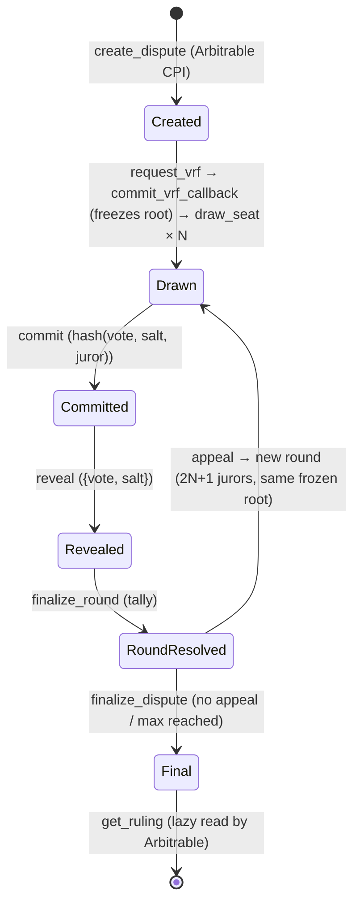

# Accord

> **Mechanize the verdict.**

Accord is a general-purpose, **capital-weighted Schelling arbitration oracle on
Solana** — an on-chain dispute-resolution primitive inspired by Kleros. Any
Solana program (the _Arbitrable_) files a subjective Dispute via two CPI calls;
the Accord draws stake-weighted Jurors (VRF), collects commit-reveal votes, and
emits a Ruling governed by game-theoretic incentives (an honest-stake-majority
assumption) instead of a hired-judge committee.

> [!IMPORTANT] > **Accord is an arbitration oracle, not a self-enforcing decentralized court.**
> Several roles hold privileged or concentrated power (Subaccord authority,
> upgrade multisig, VRF provider, indexer, cranker, large stakeholders, evidence
> operator). The honest [Trust Profile](apps/docs/docs/security/trust-profile.md)
> states every residual assumption and the security-value ceiling. Read it before
> securing real value. This is pre-mainnet, unaudited software.

It is a **standalone, reusable product**: the Accord has no knowledge of the
filing program's domain. Dispute resolution becomes composable infrastructure.

```text
your program ──create_dispute()──► Accord ──draws jurors, runs commit/reveal──► Ruling
      ▲                                                                            │
      └────────────────────────────get_ruling()────────────────────────────────────┘
```

## Key Features

- **Schelling Point = honesty (honest-majority-stake assumed).** Jurors converge
  on the truthful answer because voting coherently with the majority is the
  profitable strategy. No central judge is picked — but see the
  [Trust Profile](apps/docs/docs/security/trust-profile.md): Schelling honesty
  holds conditional on an honest stake majority.
- **Party-agnostic Arbitrable interface.** Integrate with two CPI calls:
  `create_dispute()` → `get_ruling()`. The Accord never learns your domain.
- **Permissionless Subaccords.** Specialized Juror pools (automotive,
  freelancing, NFTs, …). Anyone can register one; each defines its own staking
  token, min stake, windows, and slash factor.
- **Per-Subaccord staking token.** Each pool picks the SPL token Jurors stake
  (USDC by default). Stake is the anti-sybil mechanism _and_ the
  coherence-slashing substrate.
- **Verifiable sortition.** Stake-weighted Juror draw over a **live on-chain
  stake accumulator** (a Merkle-Sum Tree maintained on every `stake`/`unstake`),
  seeded by a committed VRF. The root is canonical by construction — no posted
  root, no bond, no challenge window — so the draw is manipulation-resistant by
  mechanism, not by fraud-proof (ADR-0012; supersedes ADR-0003/0008/0009).
- **Commit-reveal + exponential appeals.** Secret votes prevent vote-copying so
  the Schelling Point forms independently; each appeal doubles the panel + 1
  (3 → 7 → 15 → 31), making bribery more expensive (deterred, not impossible —
  see the security-value ceiling).

> [!IMPORTANT] > **Project status.** The on-chain program (`programs/accord`) implements the
> full v1 instruction set with a LiteSVM unit-test per instruction. The
> TypeScript SDK (`packages/sdk`) and the jest/ Surfpool integration suite
> (`tests/`) are scaffolded and under active development (Codama codegen —
> ADR-0010). See [Project Status](#project-status). This is pre-mainnet,
> unaudited software — do not secure real value with it yet.

---

## Table of Contents

- [Tech Stack](#tech-stack)
- [Prerequisites](#prerequisites)
- [Getting Started](#getting-started)
- [Architecture](#architecture)
  - [Monorepo Layout](#monorepo-layout)
  - [How a Dispute Is Resolved](#how-a-dispute-is-resolved)
  - [Account & PDA Model](#account--pda-model)
  - [Draw & Verifiable Sortition](#draw--verifiable-sortition)
  - [Economics](#economics)
  - [Evidence Flow](#evidence-flow)
- [The Arbitrable Interface](#the-arbitrable-interface)
- [Environment Variables](#environment-variables)
- [Available Commands](#available-commands)
- [Testing](#testing)
- [Project Status](#project-status)
- [Deployment](#deployment)
- [Troubleshooting](#troubleshooting)
- [Contributing](#contributing)
- [License](#license)
- [Further Reading](#further-reading)

---

## Tech Stack

- **Program language**: Rust (Anchor framework)
- **Framework**: Anchor `1.0.2`
- **Runtime**: Solana `3.1.10` (BPF; host Rust via `rust-toolchain.toml` = stable)
- **Randomness**: Magicblock / Solana VRF (`ephemeral-rollups-sdk 0.16.2`, scoped per-program identity via `ephemeral_rollups_sdk::vrf::consts::scoped_vrf_identity`)
- **Token layer**: SPL Token + Associated Token (`anchor-spl 1.0.2`)
- **SDK**: TypeScript (`@solana/web3.js`, `@anchor-lang/core`) — Codama +
  Solana Kit codegen pipeline (ADR-0010)
- **Docs**: MkDocs Material (`apps/docs/`)
- **Package manager**: pnpm `9.15.0` (workspaces) + Cargo (Rust workspace)
- **Lint/format**: `rustfmt`, `clippy`, `tsc --noEmit`, Prettier, ESLint,
  markdownlint, gitleaks (via pre-commit)

## Prerequisites

- **Rust** (stable) — `curl --proto '=https' --tlsv1.2 -sSf https://sh.rustup.rs | sh`
- **Node.js 20+** and **pnpm 9.x** — `corepack enable && corepack prepare pnpm@9.15.0 --activate`
- **Solana CLI** + **Anchor** — installed automatically by `make prep` (below)
- **Poetry** (only for the docs site) — `curl -sSL https://install.python-poetry.dev | python3 -`

> [!TIP] > `make prep` installs Solana `3.1.10` (via `solana-install`) and Anchor
> `1.0.2` (via `avm`) for you — you do not need to pin them manually.

## Getting Started

### 1. Clone the repository

```bash
git clone https://github.com/xeroc/accord.git
cd accord
```

### 2. Install toolchains and dependencies

```bash
make prep
```

This runs `solana-install init 3.1.10`, installs Anchor `1.0.2` through `avm`,
and runs `pnpm install` across the workspace. Re-run only when toolchain
versions change.

### 3. Build the program and workspace

```bash
make build
```

`make build` runs `anchor build` (compiles `programs/accord` to
`target/deploy/accord.so` and emits the IDL) followed by `pnpm -r run build`
(the SDK and any apps). The first build downloads and compiles the Solana BPF
toolchain — expect a few minutes.

### 4. Configure your wallet / cluster

The provider defaults to `localnet` with `~/.config/solana/id.json`
(see `Anchor.toml`). Generate a keypair if you don't have one:

```bash
solana-keygen new
```

Switch clusters with the Solana CLI:

```bash
solana config set --url localhost      # local validator / Surfpool
solana config set --url devnet         # devnet
```

### 5. Run the tests

The full suite (Rust unit tests + LiteSVM + jest e2e) runs in a single command —
`anchor test` auto-starts a Surfpool instance, deploys the program, and runs
everything:

```bash
make test             # full suite (anchor test — auto-starts Surfpool)
```

For fast iteration on Rust/​LiteSVM tests only (no validator):

```bash
make test_unit
```

See [Testing](#testing) for the two-harness philosophy.

---

## Architecture

### Monorepo Layout

```text
.
├── programs/
│   ├── accord/                 # The on-chain arbitration program (Anchor)
│   │   ├── src/
│   │   │   ├── lib.rs          # Thin #[program] wrappers (IDL docs + dispatch)
│   │   │   ├── instructions/   # Per-instruction handler + Accounts context
│   │   │   ├── state.rs        # Account structs, enums, PDA proof types
│   │   │   ├── constants.rs    # Size bounds, windows, seeds, byte-offset layout
│   │   │   ├── attestation.rs  # SAS attestation parsing + credential gate
│   │   │   ├── utils.rs        # MST math, settlement, panel-sizing helpers
│   │   │   ├── tests.rs        # Host unit tests (layout pins, MST math)
│   │   │   ├── errors.rs       # AccordError codes
│   │   │   └── events.rs       # Emitted events for off-chain indexers
│   │   ├── tests/              # LiteSVM unit tests (one file per instruction)
│   │   ├── accord.qedspec      # Formal-verification spec (qedgen)
│   │   ├── SPEC.md             # v1 build spec (account model, state machine)
│   │   └── security-checklist.md
│   ├── canon/                  # Canon — curated-list registry Arbitrable (Anchor)
│   └── synod/                  # Synod — N-party dispute-escrow Arbitrable (stub; SPEC + ADRs)
├── packages/
│   ├── sdk/                    # @useaccord/sdk — TypeScript SDK (Codama client, facades, evidence crypto)
│   └── canon/                  # @useaccord/canon — Canon SDK facade (Codama client + PDA helpers)
├── tests/                      # jest + Surfpool integration suite (accord + canon e2e)
├── apps/
│   ├── cli/                    # useaccord — operator CLI over the SDK
│   ├── cranker/                # Lifecycle cranker (permissionless cranks, accord + canon)
│   ├── evidence-daemon/        # Evidence Operator daemon (ADR-0011)
│   ├── app/                    # Accord dApp (React + Vite)
│   ├── canon/                  # Canon Registry dApp (React + Vite)
│   ├── landing/                # Landing page
│   └── docs/                   # Documentation hub
│       ├── docs/               # MkDocs site content (integration, reference, security)
│       └── adr/                # ADRs — repo-only, per-program series (accord/, canon/, synod/)
├── formal_verification/        # Lean / qedgen harness
├── CONTEXT.md                  # Domain language (ubiquitous-language glossary)
├── PROJECT.md                  # Project rationale (the "why")
├── BRAND.md                    # Brand model
├── Cargo.toml                  # Rust workspace
├── Anchor.toml                 # Anchor workspace + provider + test script
├── Makefile                    # Build / test / lint orchestration
├── pnpm-workspace.yaml         # TS workspace globs (apps/*, packages/*, tests)
└── tsconfig.base.json          # Shared TS compiler options
```

> [!NOTE]
> The root `package.json` intentionally has **no `scripts`** block. The Makefile
> orchestrates builds; lint/test fan out via pnpm's recursive filter. Don't add
> root scripts — they'd duplicate the Makefile.

### How a Dispute Is Resolved

The dispute lifecycle is a state machine advanced by **permissionless cranks**
(anyone can move it forward when a window elapses):



Odd Juror counts (3 / 7 / 15 / 31) make full-reveal ties impossible in binary
disputes. A Plurality top-count tie — possible in multi-option rounds (2-2-1
on a full-reveal 5-panel) or from non-reveal splits (2-2 of 4 revealed) — is a
**non-decisive round**: `finalize_round` writes no result and hands the round
to the ADR-0021 redraw ladder (`RedrawEligible` → fresh same-size panel, or
`Failed` with the filer refund on `max_draw_attempts` exhaustion) — never an
arbitrary winner (ADR-0026).

### Account & PDA Model

Every account stores its canonical `bump` so handlers reuse the same PDA
without re-deriving. Large accounts (`Round`) are `#[zero_copy]` (`AccountLoader`)
to fit BPF's stack.

| Account         | Seeds                               | Purpose                                                                                                                                                      |
| --------------- | ----------------------------------- | ------------------------------------------------------------------------------------------------------------------------------------------------------------ |
| `Subaccord`     | `["subaccord", creator, domain_ref]` | A specialized Juror pool: staking token, windows, alpha, authority. Holds the **stake accumulator root** (`root_hash`, `total_stake`, `next_index`, `depth`) |
| `JurorStake`    | `["stake", subaccord, juror]`       | A Juror's staked capital + `active_draws` lock count + `tree_index` (leaf position, assigned at first stake)                                                 |
| `Dispute`       | `["dispute", filer, nonce]`         | A case: options, evidence hash, state, `final_ruling`, `committed_vrf`, `frozen_root` (set at VRF-commit)                                                    |
| `Round`         | `["round", dispute, round_idx]`     | Per-round jurors, commits, reveals, result (zero-copy)                                                                                                       |
| `AppealBond`    | `["bond", dispute, round_idx]`      | Custody record for one appeal bond                                                                                                                           |
| `PendingUpdate` | `["update", subaccord, nonce]`      | Timelocked Subaccord parameter update (48h)                                                                                                                  |
| `AccordState`   | `["state"]`                         | Singleton program-level circuit breaker                                                                                                                      |
| token vaults    | Subaccord-PDA-owned SPL accounts    | Stake pool + fee pool                                                                                                                                        |

### Draw & Verifiable Sortition

The draw is the security-critical path (ADR-0012; supersedes ADR-0003/0008/0009):

1. **Live stake accumulator.** The Subaccord's Juror set + stake weights are kept
   as an on-chain Merkle-Sum Tree **root** (`root_hash`, `total_stake`,
   `next_index`, `depth`), maintained incrementally on every `stake`/`unstake`.
   The caller supplies the juror's leaf path; the chain verifies it against the
   stored root, reads the **live** `JurorStake.amount`, applies the verified vault
   delta, and recomputes the root (O(log N)). The full tree lives off-chain
   (indexers) but any auditor can rebuild the root from `JurorStake` via
   `getProgramAccounts` and check it on-chain. The root is canonical by
   construction — there is no posted root to withhold or fabricate.
2. **VRF + frozen root.** `request_vrf` asks the VRF oracle for randomness; the
   oracle's identity-signed `commit_vrf_callback` lands the result **and** freezes
   `dispute.frozen_root = subaccord.root`. Freezing when randomness becomes known
   (not at filing) keeps capital fully live until the draw and closes the
   manipulation window. One VRF + one frozen root serve the whole dispute; appeals
   draw a larger panel from the same fixed pool.
3. **Per-seat draw.** A permissionless cranker submits each seat's membership
   proof in its own `draw_seat` tx (the 1232-byte packet can't hold N proofs). The
   program verifies each proof against `frozen_root`, checks the sortition
   criterion (`prefix ≤ r_i < prefix + stake`, prefix derived from authenticated
   sibling sums), enforces the inflation guard (`JurorStake.amount ≥ leaf.stake`),
   and samples without replacement. No `draw_attempt` grind, no collision liveness
   stall.

### Economics

Inherited from Kleros (live since 2019, 1000+ disputes):

- **Fee:** filer pays `N · fee_per_juror`; appellant pays `N_new · fee_per_juror` + bond.
- **Slash:** each Incoherent Juror loses `α · min_stake` (flat; ADR-0003).
- **Redistribution:** forfeited fees + slashed stake → Coherent Jurors, equal split.
- **Non-reveal penalty:** ≥ the Incoherent penalty (forces reveal).
- **Appeal bond:** forfeited to Coherent Jurors of the _final_ round if the
  appeal does not flip the prior Ruling; returned if it flips.
- **Cross-round settlement:** every round is re-settled against the final Ruling.

### Evidence Flow

The Accord stores only an evidence _hash_ on-chain (ADR-0006). A
Subaccord-designated **Evidence Operator** re-encrypts the evidence for the
drawn Jurors off-chain:

```text
claimant ──encrypt(evidence, operator_pubkey)──► encrypted blob ──► off-chain store
on-chain Accord: evidence_hash only
dispute filed + Jurors drawn
   ▼
evidence_operator service: decrypt → re-encrypt per drawn Juror (+ optional watermark)
   ▼
Juror decrypts, verifies cleartext vs on-chain evidence_hash
```

---

## The Arbitrable Interface

Your program integrates with two CPI calls. The Accord handles everything else.

```rust
// 1. File the dispute
let dispute = accord::create_dispute(
    ctx.accounts.clone(),
    vec![option_a_hash, option_b_hash], // 2..=8 option hashes (Plurality); scalar Median pools file none
    evidence_hash,                       // commitment to the evidence
    nonce,                               // caller-chosen, for PDA uniqueness
    fee,                                 // INITIAL_NUM_JURORS (3) * fee_per_juror
)?;

// 2. Read the ruling (lazy — call whenever, after finalization)
let ruling: Option<u64> = accord::get_ruling(ctx.accounts.dispute)?; // option index, or the median for scalar pools (ADR-0025)
```

```typescript
import { Accord } from "@useaccord/sdk";

// File a dispute
const { dispute } = await accord.createDispute({
  subaccord: subaccordAddress,
  options: [hashOption("Yes"), hashOption("No")],
  evidenceHash: evidenceCommitment,
  nonce: 1n,
  fee: requiredFee,
});

// Later: read the ruling (0 = option A, 1 = option B for Plurality; a u64
// scalar (e.g. settlement-mint base units) for Median pools; null = not final)
const ruling = await accord.getRuling(dispute);
```

> [!NOTE]
> The full instruction surface (24 instructions) is documented in the
> [Protocol Reference](https://example.com/TBD/reference/instructions/) and
> `programs/accord/SPEC.md`. Integrators normally only need `create_dispute`
> and `get_ruling`; the rest are permissionless cranks.

---

## Environment Variables

The program is configured on-chain (per-Subaccord params), not via env vars.
Local development needs only Solana CLI config:

| Variable        | Description                                                  | Example                    |
| --------------- | ------------------------------------------------------------ | -------------------------- |
| `ANCHOR_WALLET` | Path to the provider keypair (defaults to Solana CLI config) | `~/.config/solana/id.json` |
| `RPC_URL`       | Cluster RPC endpoint (or use `solana config set --url`)      | `localhost:8899`           |

`Anchor.toml` pins the provider:

```toml
[provider]
cluster = "localnet"
wallet = "~/.config/solana/id.json"
```

---

## Available Commands

All orchestration lives in the root `Makefile`. The root `package.json` has no
scripts by design.

| Command                                   | Description                                                               |
| ----------------------------------------- | ------------------------------------------------------------------------- |
| `make prep`                               | Install Solana `3.1.10` + Anchor `1.0.2` (via `avm`), then `pnpm install` |
| `make build`                              | `anchor build` (programs) then `pnpm -r run build` (packages/apps)        |
| `make test`                               | Full suite: Rust unit + LiteSVM + jest e2e (`anchor test` auto-starts Surfpool) |
| `make test_unit`                          | LiteSVM Rust unit/TDD tests (fast, no validator)                          |
| `make run_surfpool`                       | Start a Surfpool Surfnet manually (for isolated e2e debugging)            |
| `make test_surfpool`                      | Run jest e2e suite only (needs a running Surfpool/validator)             |
| `make lint`                               | Lint every workspace that declares a lint script                          |
| `make clean`                              | Remove build artifacts and `node_modules`                                 |
| `cd programs/accord && cargo test`        | Rust unit tests in isolation                                              |
| `cd packages/sdk && pnpm run build`       | Build the SDK                                                             |
| `cd tests && npx jest -t "<name>"`        | Run a single integration test by name                                     |
| `cd apps/docs && poetry run mkdocs serve` | Serve the docs site locally (localhost:8000)                              |

Per-package lint auto-fix (where defined):

```bash
pnpm --filter @useaccord/sdk run lint:fix
```

---

## Testing

The project uses **two complementary harnesses** (decision `veridao-8ys4`):

### LiteSVM — fast in-process unit tests

- **Location:** `programs/accord/tests/*_litesvm.rs`
- **Run:** `make test_unit`
- **What it is:** `anchor-litesvm` `0.4.x` runs the real compiled `.so`
  in-process — no validator. One fresh `AnchorLiteSVM` context per test. Each
  instruction has a test file covering happy-path, authority, reinit guard,
  timelock, arithmetic, and closure cases.

### jest + Surfpool — full end-to-end

- **Location:** `tests/*.spec.ts`
- **Run:** `make test` (runs the full suite including e2e; `anchor test`
  auto-starts Surfpool, deploys the program, and runs jest). For isolated e2e
  iteration: `make run_surfpool` then `make test_surfpool`.
- **What it is:** the real validator behaviour — CPI chains, VRF, token
  transfers, Surfpool cheatcodes (time-warp, token injection). Long-running
  (`testTimeout: 120000`).

### TDD workflow

Every feature/instruction follows **RED → GREEN → REFACTOR**. The failing test
ships first; no exceptions. A milestone is `completed` only when all its leaf
tests are green.

> [!IMPORTANT] > **The `no-entrypoint` feature quirk.** The program's `entrypoint!` symbol
> collides with a builtin when the crate is statically linked into the test
> binary. Rust tests therefore build `accord` with `--features no-entrypoint`
> (types only). The `.so` — built separately via `cargo build-sbf` /
> `anchor build` **with** the entrypoint — is what LiteSVM loads. All
> `*_litesvm.rs` files are gated with `#![cfg(feature = "no-entrypoint")]` so
> `anchor build` (which doesn't pass the feature) skips them during IDL gen.
> `make test_unit` handles both steps.

---

## Project Status

| Component                              | Status         | Notes                                                              |
| -------------------------------------- | -------------- | ------------------------------------------------------------------ |
| `programs/accord` (on-chain)           | ✅ Implemented | Full v1 instruction set + per-instruction LiteSVM tests            |
| `programs/canon` (on-chain)            | ✅ Implemented | Curated-list Arbitrable (ADR `canon/0001`) + LiteSVM & e2e specs   |
| `programs/synod` (on-chain)            | 🚧 Specced     | Stub crate — SPEC + ADRs `synod/0001`–`0002`; e2e blocked on the Accord tie fix (`accord-n3vw`) |
| Formal verification (`accord.qedspec`) | ⚠️ Declared    | Four economic invariants modeled; pending VRF/param-bounds binding |
| `@useaccord/sdk` (TypeScript)          | ✅ Implemented | Codama codegen (ADR-0010) + facades, PDAs, `sdk/evidence` crypto   |
| `@useaccord/canon` (TypeScript)        | ✅ Implemented | Canon facade over its own Codama client                            |
| `tests/` (jest/Surfpool)               | ✅ Implemented | Per-instruction-group e2e specs (accord + canon), green via `make test` |
| Apps (CLI, cranker, evidence-daemon, dApps, landing) | ✅ Built | Consume the SDKs; lint/build/test green in CI        |
| `apps/docs` (MkDocs)                   | ✅ Live        | Full integration guide, protocol reference, security docs, ADRs    |
| Security audit                         | ❌ Not started | Pre-mainnet; do not secure real value yet                          |

---

## Deployment

### Deploy the program

The program ID is set in `declare_id!` (`programs/accord/src/lib.rs`) and
mirrored in `Anchor.toml`. The canonical deploy keypair is provisioned by the
operator (see AGENTS.md §Gotchas); until then, local builds use
`--ignore-keys` to skip the keypair check.

```bash
# Devnet
solana config set --url devnet
anchor build --ignore-keys
anchor deploy --provider.cluster devnet

# Verify the deployed program
solana program show <PROGRAM_ID>
```

### Upgrade authority (ADR-0007)

The upgrade authority is a **Squads multisig** at launch; after a sufficient
audit it is set to `None` (frozen, immutable). The on-chain `AccordState`
singleton (seeds `["state"]`) is a separate circuit breaker: `pause()` is
instant and authority-gated; `unpause()` is timelocked
(`propose_unpause` → `execute_unpause` after `UNPAUSE_TIMELOCK_SLOTS`) so a
freeze is always recoverable on a known schedule. While paused, `create_dispute`
/ `stake` / `appeal` revert; in-flight disputes resolve normally.

### Initialize after deploy

Bundle the pause-singleton init with deploy (front-running is an ops concern):

```bash
# initialize_pause — the caller becomes the pause authority (the Squads multisig).
# Invoke it once, ideally bundled with the deploy tx (front-running is an ops
# concern). There is no Makefile target yet — call the instruction directly via
# the SDK / a small script, e.g.:
#   accord.methods.initializePause().accounts({...}).rpc()
```

### Mainnet readiness — re-evaluate before the first mainnet deploy

Everything below freezes the moment real state exists on mainnet. Renames and
layout decisions are one-way doors; walk this list (and the open findings in
`programs/*/security-checklist.md` + the
[Trust Profile](apps/docs/docs/security/trust-profile.md)) before deploying:

- **PDA seeds.** Every `SEED_*` constant (`programs/accord/src/constants.rs`,
  `programs/canon/src/constants.rs`) becomes permanent once its accounts
  exist. ✅ Done pre-mainnet (2026-08-14): the circuit-breaker singleton was
  renamed end-to-end — type `PauseState` → `AccordState`, seed `b"pause"` →
  `b"state"`, IDL/SDK surface `pauseState` → `accordState` — with a **fresh
  discriminator (deliberately not pinned)** and the devnet reset accepted.
  Preps consumed by that reset: redeploy accord, re-run `initialize_pause`,
  re-stake. Any seed change after the first mainnet deploy means new PDAs +
  state migration — treat seeds as frozen from that point on.
- **Program IDs + deploy keypairs.** `declare_id!` (accord
  `cordhVosh…`, canon `can5Zhfg…`) is immutable once deployed. **Synod's
  `declare_id!` is still the `anchor new` placeholder** — generate and
  provision its canonical keypair (multisig-controlled, per AGENTS.md
  §Gotchas) before the first build, and keep
  `anchor build --ignore-keys` discipline until then.
- **Account data layouts.** `InitSpace`, field order, Anchor discriminators,
  and the zero-copy `Round` offset consts — any post-deploy change requires a
  state migration. Freeze layouts in review before deploy.
- **Instruction wire format.** Argument order/types + account order are the
  IDL/SDK contract; changing them after deploy breaks every client and
  indexer bound to the published IDL.
- **Open sentinel decisions** (`Pubkey::default()` / `ponytail` markers):
  `evidence_operator` identity (ADR-0006/0011), the canon retuning gate
  (Subaccord authority = CanonList PDA; the gated instruction is not yet
  built), and the upgrade authority hand-off (ADR-0007 Squads multisig →
  freeze).
- **Protocol constants.** `MAX_JURORS`, accumulator tree depth, the panel
  ladder, `UPDATE_TIMELOCK_SLOTS` / `UNPAUSE_TIMELOCK_SLOTS`,
  `MIN_APPEAL_WINDOW_SECS`, fee/bond shapes. Per-Subaccord economics stay
  retunable; these constants do not.
- **VRF provider identity.** The Magicblock scoped-VRF identity and oracle
  trust assumptions (ADR-0012) — confirm the production configuration.
- **Audit sign-off.** Resolve the open L-/M-/REVIEW findings cited in
  `security-checklist.md` and re-baseline the trust-profile
  security-value ceiling for mainnet stakes.

---

## Troubleshooting

### `cargo build-sbf` fails on `edition2024`

**Cause:** Solana CLI `< 3.x` bundles platform-tools v1.48 / cargo 1.84, which
can't parse `edition2024` manifests.

**Fix:** `make prep` installs Solana `3.1.10`, which drops the flag. If you
must invoke `cargo build-sbf` directly on an older CLI, pass
`--tools-version v1.52`. (`anchor build` manages its own toolchain and is
unaffected.)

### LiteSVM test fails: `read …/accord.so — run cargo build-sbf first`

The `.so` must be built **before** the unit tests load it. `make test_unit`
does both; if you run `cargo test` directly, build first:

```bash
cargo build-sbf --manifest-path programs/accord/Cargo.toml
cargo test --manifest-path programs/accord/Cargo.toml --features no-entrypoint
```

### Program ID mismatch / `declare_id!` out of sync

`anchor build` without `--ignore-keys` fails when the gitignored worktree
keypair doesn't match `declare_id!`. This is expected — the worktree keypair is
throwaway. Use `--ignore-keys` (all Makefile targets already do):

```bash
anchor build --ignore-keys
```

**Never run `anchor keys sync` without the canonical keypair** — it would
rewrite `declare_id!` to adopt the random worktree key, desyncing the SDK,
tests, and Codama client. The canonical keypair is provisioned by the operator
(see AGENTS.md §Gotchas).

### `anchor build` IDL generation blocked

On Anchor `1.0.2` + Solana `3.x` deps, IDL generation is unblocked end-to-end
via the `idl-build` feature (see `programs/accord/Cargo.toml`). If you hit an
older Anchor, ensure the crate declares `idl-build` in `[features]`.

### jest integration tests can't connect

Integration tests need a running validator. Start Surfpool first:

```bash
make run_surfpool     # keeps running; use a separate terminal
make test_surfpool
```

### Native extension / build failures

Ensure the Solana BPF toolchain and system libs are present. `make prep`
handles the Solana side; for host crates you need a working `rustc` (stable)
and standard build essentials (`build-essential` / Xcode CLT).

---

## Contributing

1. **Read first:** `CONTEXT.md` (domain language) → this README →
   `apps/docs/adr/` (the _why_ behind every locked decision).
2. **TDD only.** Write the failing test first, then implement to pass.
3. **Lint is law.** Run `make lint` (and the relevant test) before committing.
   Pre-commit hooks (`fmt`, `cargo-check`, `markdownlint`, `gitleaks`,
   `detect-private-key`) run automatically.
4. **Track work with beans.** This repo uses the `beans` CLI for issue
   tracking. Check
   `beans list --json --ready` before assuming docs reflect reality — active
   milestones may supersede code state. Include relevant bean IDs in commit
   messages (the bean prefix is `accord-` per `.beans.yml`).
5. **ADRs are immutable once deployed.** A superseded decision gets a new ADR
   that references the old one.

Install the git hooks:

```bash
pip install pre-commit
pre-commit install
```

---

## License

`UNLICENSED` (private) — see `package.json`. The program crate
(`programs/accord`) ships under the workspace license.

---

## Further Reading

- **Docs site:** [docs (domain TBD)](https://example.com/TBD) — Quickstart,
  Integration Guide, Protocol Reference, Security, ADRs
- **[Trust Profile](apps/docs/docs/security/trust-profile.md)** — who holds
  power, what's trusted, the security-value ceiling
- **`CONTEXT.md`** — domain language / ubiquitous-language glossary
- **`PROJECT.md`** — project rationale (the "why")
- **`BRAND.md`** — brand model
- **`programs/accord/SPEC.md`** — v1 build spec (account model, state machine,
  economics, edge cases)
- **`programs/accord/security-checklist.md`** — security audit authority
  (findings cite `file:line`)
- **ADRs** (`apps/docs/adr/`):
  - [0001](https://example.com/TBD/adr/0001) Schelling-point Accord replaces
    hired-judge committee
  - [0002](https://example.com/TBD/adr/0002) Per-Subaccord staking token, no
    Accord token in v1
  - [0003](https://example.com/TBD/adr/0003) Draw — Merkle snapshot,
    off-chain sortition, distinct Jurors _(partially superseded by 0012)_
  - [0004](https://example.com/TBD/adr/0004) Party-agnostic; appeal is
    permissionless
  - [0005](https://example.com/TBD/adr/0005) Subaccord authority — pubkey,
    48h timelock
  - [0006](https://example.com/TBD/adr/0006) Evidence — on-chain hash,
    trusted re-encryption operator
  - [0007](https://example.com/TBD/adr/0007) Upgrade authority — Squads
    multisig, then freeze
  - [0008](https://example.com/TBD/adr/0008) Snapshot trust hardening —
    anchor-slot, fraud predicates, sortition _(partially superseded by 0012)_
  - [0009](https://example.com/TBD/adr/0009) Stake-weighted verifiable
    sortition — MST, committed VRF _(partially superseded by 0012)_
  - [0010](https://example.com/TBD/adr/0010) SDK — Codama codegen + Solana Kit
    facade
  - [0011](apps/docs/adr/accord/0011-evidence-operator-daemon-offchain-service.md) Evidence Operator Daemon —
    off-chain decrypt-re-encryption service
  - [0012](apps/docs/adr/accord/0012-on-chain-stake-accumulator-replaces-optimistic-snapshot.md) On-chain stake
    accumulator replaces the optimistic snapshot (current draw mechanism)

  Per-program ADR indexes: [Accord](apps/docs/adr/accord/index.md) ·
  [Canon](apps/docs/adr/canon/index.md) · [Synod](apps/docs/adr/synod/index.md)

---

<p align="center">
  <strong>ACCORD</strong><br>
  <em>An accord, not a committee.</em>
</p>
