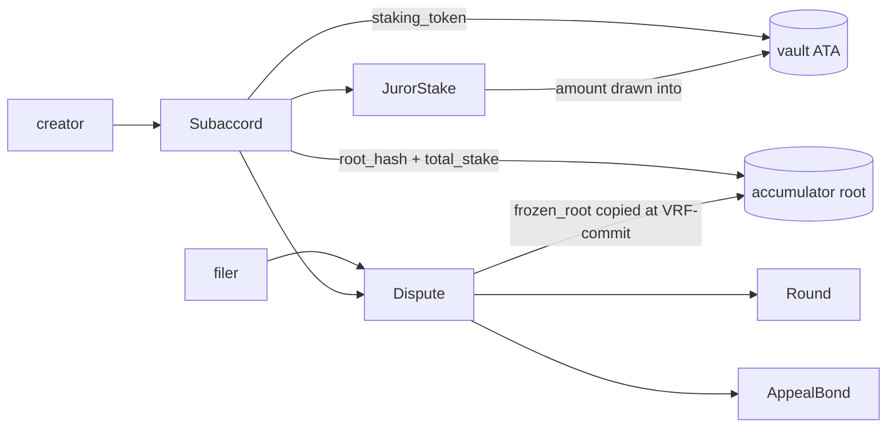

# Accounts & PDAs

Every account stores its canonical `bump` (reused, never re-derived). Large accounts (`Dispute`, `Round`) are `Box<>`-wrapped at the call site.

| Account         | Seeds                                      | Key fields                                                                                                                                                                                                                                                                                                                                                                                              | Notes                                                                                                                                                                                                                                                                                                                                                                                                                                               |
| --------------- | ------------------------------------------ | ------------------------------------------------------------------------------------------------------------------------------------------------------------------------------------------------------------------------------------------------------------------------------------------------------------------------------------------------------------------------------------------------------- | --------------------------------------------------------------------------------------------------------------------------------------------------------------------------------------------------------------------------------------------------------------------------------------------------------------------------------------------------------------------------------------------------------------------------------------------------- |
| `Subaccord`     | `["subaccord", creator, risk_type]`        | `creator`, `staking_token`, `min_stake`, `alpha_bps`, `review/commit/reveal_window`, `max_appeals`, `aggregation`, `fee_per_juror`, `authority`, `evidence_operator`, `risk_type`, `evidence_spec`, `staker_count`, **accumulator: `root_hash`, `total_stake`, `next_index`, `depth`**, `bump`                                                                                                          | Permissionless. `risk_type` + `evidence_spec` immutable. `authority == default` ⇒ immutable. `staker_count` = distinct Jurors with `amount > 0` (coarse intake gate). Accumulator root is canonical by construction ([ADR-0012](../adr/0012-on-chain-stake-accumulator-replaces-optimistic-snapshot.md)). [ADR-0002](../adr/0002-per-subaccord-staking-token-no-accord-token-v1.md), [ADR-0005](../adr/0005-subaccord-authority-pubkey-timelock.md) |
| `JurorStake`    | `["stake", subaccord, juror]`              | `subaccord`, `juror`, `amount`, `active_draws`, `tree_index`, `bump`                                                                                                                                                                                                                                                                                                                                    | `unstake` reverts while `active_draws > 0`. `tree_index` = leaf position in the Subaccord accumulator, assigned at first stake, immutable (full unstake zeros the leaf; re-stake reuses the index).                                                                                                                                                                                                                                                 |
| `Dispute`       | `["dispute", filer, nonce]`                | `subaccord`, `filer`, `nonce`, `num_options`, `options: [[u8;32]; MAX_OPTIONS]`, `evidence_hash`, `state`, `current_round`, `terms: CaseTerms` (filing-time freeze — carries `aggregation`, ADR-0019), `final_ruling: u8` (`u8::MAX` until `Final`), `finalized_at: i64`, `fee_paid: u64`, `committed_vrf: Option<[u8;32]>`, `frozen_root: [u8;32]`, `frozen_total_stake: u64`, `filed_at: i64`, `bump` | `committed_vrf` + `frozen_root` set once by `commit_vrf_callback` (root copied from `subaccord.root_hash`); `draw_seat` reads both immutably. `terms` freezes the Subaccord's economics + `aggregation` (ADR-0019) at filing (Ugly-6); `finalize_round` tallies off `terms.aggregation`. `final_ruling` = `u8::MAX` until `Final` (sentinel, not `Option` — keeps the account fixed-size; mirrors `Round`'s sentinels).                             |
| `Round`         | `["round", dispute, round_idx]`            | `round_idx`, `juror_count`, `commit_count`, `reveal_count`, `review_end`, `commit_end`, `reveal_end`, `result`, `jurors: [Pubkey; MAX_JURORS]`, `commits: [[u8;32]; MAX_JURORS]`, `reveals: [u8; MAX_JURORS]`, `bump`                                                                                                                                                                                   | `#[zero_copy]` (`AccountLoader`). Too large for BPF 4 KB stack under `Account<Round>`. `reveals`/`result` use `u8::MAX` sentinels (not `Option`, which is not `Pod`). Fields reordered + padded for `bytemuck::Pod`.                                                                                                                                                                                                                                |
| `AppealBond`    | `["bond", dispute, round_idx]`             | `dispute`, `round_idx`, `appellant`, `amount`, `prior_result`, `bump`                                                                                                                                                                                                                                                                                                                                   | `round_idx` = round the appeal opens (larger panel). `prior_result` = winner being appealed. Flip check at settle = `final_ruling != prior_result`. [ADR-0004](../adr/0004-accord-party-agnostic-permissionless-appeal.md)                                                                                                                                                                                                                          |
| `PendingUpdate` | `["update", subaccord, nonce]`             | `subaccord`, `nonce`, `proposed: UpdatePayload`, `proposed_by`, `execute_after_slot`, `bump`                                                                                                                                                                                                                                                                                                            | 48h timelock. No-op while `Subaccord.authority == default`. Closed on execute (rent to caller). [ADR-0005](../adr/0005-subaccord-authority-pubkey-timelock.md)                                                                                                                                                                                                                                                                                      |
| `PauseState`    | `["pause"]` (singleton)                    | `authority`, `paused`, `pending_unpause_after: Option<u64>`, `bump`                                                                                                                                                                                                                                                                                                                                     | `pause` instant + authority-gated; `unpause` timelocked. [ADR-0007](../adr/0007-upgrade-authority-multisig-then-freeze.md), [circuit breaker](../security/circuit-breaker.md)                                                                                                                                                                                                                                                                       |
| Vault           | Subaccord-PDA-owned ATA of `staking_token` | —                                                                                                                                                                                                                                                                                                                                                                                                       | SPL `TokenAccount`; `authority` = Subaccord PDA. Holds staked capital + all fees/bonds. PDA-signed on every out-transfer.                                                                                                                                                                                                                                                                                                                           |

The `Snapshot` account is removed ([ADR-0012](../adr/0012-on-chain-stake-accumulator-replaces-optimistic-snapshot.md)); the juror-set root now lives on `Subaccord` as the accumulator.

