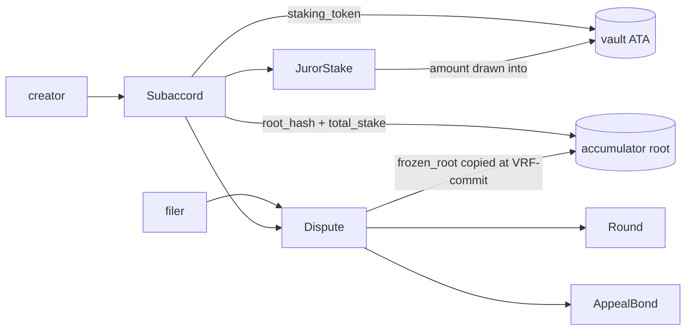

# Accounts & PDAs

Every account stores its canonical `bump` (reused, never re-derived). Large accounts (`Dispute`, `Round`) are `Box<>`-wrapped at the call site.

| Account         | Seeds                                      | Key fields                                                                                                                                                                                                                                                                                                                                                                                                                     | Notes                                                                                                                                                                                                                                                                                                                                                                                                                                                                                                                   |
| --------------- | ------------------------------------------ | ------------------------------------------------------------------------------------------------------------------------------------------------------------------------------------------------------------------------------------------------------------------------------------------------------------------------------------------------------------------------------------------------------------------------------ | ----------------------------------------------------------------------------------------------------------------------------------------------------------------------------------------------------------------------------------------------------------------------------------------------------------------------------------------------------------------------------------------------------------------------------------------------------------------------------------------------------------------------- |
| `Subaccord`     | `["subaccord", creator, domain_ref]`        | `creator`, `staking_token`, `fee_token`, `min_stake`, `alpha_bps`, `review/commit/reveal_window`, `appeal_window` (per-Subaccord, [ADR-0022](https://github.com/xeroc/accord/blob/main/apps/docs/adr/accord/0022-per-subaccord-configurable-appeal-window.md)), `max_appeals`, `min_jury_size`, `aggregation` (`Plurality` or `Median`, [ADR-0025](https://github.com/xeroc/accord/blob/main/apps/docs/adr/accord/0025-scalar-voting.md)), `coherence_tol_bps: u16` (Median coherence band, default 100 = ±1%, `≤ 10_000`, `0` = exact; immutable — [ADR-0025](https://github.com/xeroc/accord/blob/main/apps/docs/adr/accord/0025-scalar-voting.md)), `reveal_threshold_bps`, `fee_per_juror`, `authority`, `evidence_operator`, `domain_ref`, `evidence_spec`, `juror_credential`, `juror_schema` (attestation gate, default ⇒ stake-only; PROG-ATTESTTION), `staker_count`, **accumulator: `root_hash`, `total_stake`, `next_index`, `depth`**, `bump` | Permissionless. `domain_ref` + `evidence_spec` + `juror_credential` + `juror_schema` + `coherence_tol_bps` immutable. `authority == default` ⇒ immutable. `staker_count` = distinct Jurors with `staked > 0` (coarse intake gate). `juror_credential`/`juror_schema` default ⇒ stake-only; when set (both-or-neither) a Juror must present a matching SAS attestation to `stake`/`draw_seat` ([ADR-0024](https://github.com/xeroc/accord/blob/main/apps/docs/adr/accord/0024-attestation-gated-subaccords.md)). Accumulator root is canonical by construction ([ADR-0012](https://github.com/xeroc/accord/blob/main/apps/docs/adr/accord/0012-on-chain-stake-accumulator-replaces-optimistic-snapshot.md)). [ADR-0002](https://github.com/xeroc/accord/blob/main/apps/docs/adr/accord/0002-per-subaccord-staking-token-no-accord-token-v1.md), [ADR-0005](https://github.com/xeroc/accord/blob/main/apps/docs/adr/accord/0005-subaccord-authority-pubkey-timelock.md) |
| `JurorStake`    | `["stake", subaccord, juror]`              | `subaccord`, `juror`, `amount`, `active_draws`, `tree_index`, `bump`                                                                                                                                                                                                                                                                                                                                                           | `unstake` reverts while `active_draws > 0`. `tree_index` = leaf position in the Subaccord accumulator, assigned at first stake, immutable (full unstake zeros the leaf; re-stake reuses the index).                                                                                                                                                                                                                                                                                                                     |
| `Dispute`       | `["dispute", filer, nonce]`                | `subaccord`, `filer`, `nonce`, `num_options`, `options: [[u8;32]; MAX_OPTIONS]` (empty for `Median` scalar disputes), `evidence_hashes`, `state`, `current_round`, `drawn_seats: u32` (seats landed for the current round, mirrored by `draw_seat`; the pre-draw `cancel_dispute` requires the Round + JurorStake accounts when > 0 — H-2 2026-08-19), `terms: CaseTerms` (filing-time freeze — carries `aggregation` + `coherence_tol_bps` + `appeal_window`, ADR-0019/0022/0025), `final_ruling: u64` (`u64::MAX` until `Final`), `finalized_at: i64`, `fee_paid: u64`, `committed_vrf: Option<[u8;32]>`, `frozen_root: [u8;32]`, `frozen_total_stake: u64`, `filed_at: i64`, `bump` | `committed_vrf` + `frozen_root` set once by `commit_vrf_callback` (root copied from `subaccord.root_hash`); `draw_seat` reads both immutably. `terms` freezes the Subaccord's economics + `aggregation` + `coherence_tol_bps` + `appeal_window` (ADR-0019/0022/0025) at filing (Ugly-6); `finalize_round` tallies off `terms.aggregation`, `finalize_dispute`/`appeal`/`cancel_dispute` read `terms.appeal_window`. `final_ruling` = option index (`Plurality`) or the final median (`Median`) once `Final`; `u64::MAX` sentinel until then (fixed-size account; read via `Dispute::ruling() → Option<u64>`). |
| `Round`         | `["round", dispute, round_idx]`            | `round_idx`, `juror_count`, `commit_count`, `reveal_count`, `draw_attempt`, `settled: u8`, `bump` (+2-byte pad), `review_end: i64`, `commit_end: i64`, `reveal_end: i64`, `result: u64` (`u64::MAX` = not set), `dispute: Pubkey`, `jurors: [Pubkey; MAX_JURORS]`, `commits: [[u8;32]; MAX_JURORS]`, `seat_prefix: [u64; MAX_JURORS]`, `seat_stake: [u64; MAX_JURORS]`, `reveals: [u64; MAX_JURORS]` (struct offset 2568; single-pad tiling, 2816 bytes) | `#[zero_copy]` (`AccountLoader`, `repr(C)`). Too large for BPF 4 KB stack under `Account<Round>`. `reveals`/`result` use `u64::MAX` sentinels (not `Option`, which is not `Pod`). Fields grouped by width (u32 block incl. `draw_attempt` → u8 scalars + 2-byte pad → i64 windows + `result` → byte arrays → u64 arrays) + padded for `bytemuck::Pod` ([ADR-0025](https://github.com/xeroc/accord/blob/main/apps/docs/adr/accord/0025-scalar-voting.md) re-layout). |
| `AppealBond`    | `["bond", dispute, round_idx]`             | `dispute`, `round_idx`, `appellant`, `amount`, `prior_result: u64`, `bump`                                                                                                                                                                                                                                                                                                                                                          | `round_idx` = round the appeal opens (larger panel). `prior_result` = winning value being appealed — option index (`Plurality`) or median (`Median`); u64 since [ADR-0025](https://github.com/xeroc/accord/blob/main/apps/docs/adr/accord/0025-scalar-voting.md). Flip check at settle = `final_ruling != prior_result`. [ADR-0004](https://github.com/xeroc/accord/blob/main/apps/docs/adr/accord/0004-accord-party-agnostic-permissionless-appeal.md) |
| `PendingUpdate` | `["update", subaccord, nonce]`             | `subaccord`, `nonce`, `proposed: UpdatePayload`, `proposed_by`, `execute_after_slot`, `bump`                                                                                                                                                                                                                                                                                                                                   | 48h timelock. No-op while `Subaccord.authority == default`. Closed on execute (rent to caller). [ADR-0005](https://github.com/xeroc/accord/blob/main/apps/docs/adr/accord/0005-subaccord-authority-pubkey-timelock.md)                                                                                                                                                                                                                                                                                                                                                          |
| `AccordState`    | `["state"]` (singleton)                    | `authority`, `paused`, `pending_unpause_after: Option<u64>`, `bump`                                                                                                                                                                                                                                                                                                                                                            | `pause` instant + authority-gated; `unpause` timelocked. [ADR-0007](https://github.com/xeroc/accord/blob/main/apps/docs/adr/accord/0007-upgrade-authority-multisig-then-freeze.md), [circuit breaker](../security/circuit-breaker.md)                                                                                                                                                                                                                                                                                                                                           |
| Vault           | Subaccord-PDA-owned ATA of `staking_token` | —                                                                                                                                                                                                                                                                                                                                                                                                                              | SPL `TokenAccount`; `authority` = Subaccord PDA. Holds staked capital + all fees/bonds. PDA-signed on every out-transfer.                                                                                                                                                                                                                                                                                                                                                                                               |

The `Snapshot` account is removed ([ADR-0012](https://github.com/xeroc/accord/blob/main/apps/docs/adr/accord/0012-on-chain-stake-accumulator-replaces-optimistic-snapshot.md)); the juror-set root now lives on `Subaccord` as the accumulator.

