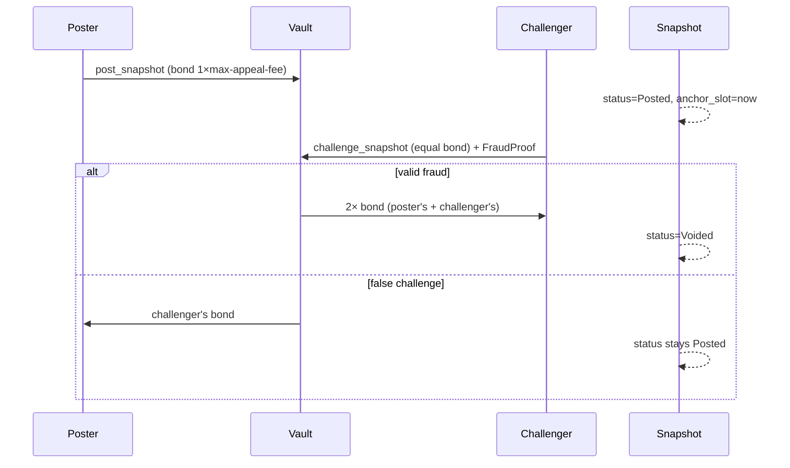

# Snapshot Fraud Proofs

A posted snapshot root is an optimistic claim. It is final only if unchallenged for `SNAPSHOT_CHALLENGE_WINDOW_SECS` (1 day) OR survives every challenge. Fraud is proven on-chain by one of five predicates in the `FraudProof` enum.

## Bond economics

| Actor                                | Bond                 | Outcome on valid fraud                       | Outcome on false challenge        |
| ------------------------------------ | -------------------- | -------------------------------------------- | --------------------------------- |
| Poster (on `post_snapshot`)          | `1 × max-appeal-fee` | forfeited (+ challenger's bond → challenger) | returned (on `finalize_snapshot`) |
| Challenger (on `challenge_snapshot`) | equal to poster's    | returned + receives poster's bond            | forfeited → poster                |

Both sweeps are PDA-signed out of the Subaccord vault. Wrong root ⇒ `Snapshot.status = Voided` (never drawable). False challenge ⇒ snapshot stays `Posted` (window still open).

## Predicates

| #   | Predicate               | What it catches                                                                              | Witness                                                                                                                                                                                                                                    | Resolution                   |
| --- | ----------------------- | -------------------------------------------------------------------------------------------- | ------------------------------------------------------------------------------------------------------------------------------------------------------------------------------------------------------------------------------------------ | ---------------------------- |
| 1   | `Duplicate`             | Two leaves at different indices with the same juror pubkey, both verifying against the root. | `leaf_a, proof_a, index_a`, `leaf_b, proof_b, index_b`                                                                                                                                                                                     | void                         |
| 2   | `Omission`              | The snapshot dropped a staked juror.                                                         | Two adjacent sorted leaves bracketing `challenger.key()` (`leaf_lo.juror < challenger < leaf_hi.juror`, consecutive indices) + challenger's `JurorStake` (`remaining_accounts[0]`) showing `last_change_slot < anchor_slot && amount > 0`. | void                         |
| 3   | `WrongStake`            | A leaf's `stake` ≠ the juror's actual anchor-time stake.                                     | `leaf, proof, index` + the juror's `JurorStake` (`remaining_accounts[0]`) with `last_change_slot < anchor_slot` ⇒ live `amount` is the anchor-time amount; require `amount != leaf.stake`.                                                 | void                         |
| 4   | `Inflation` (at `draw`) | Leaf overstates a juror's stake.                                                             | Enforced in `draw`, not `challenge_snapshot`: `JurorStake.amount ≥ leaf.stake`. Reads live state — race-immune.                                                                                                                            | draw reverts `InflatedStake` |
| 5   | `NotSorted`             | Tree not sorted by juror pubkey ascending (breaks omission proofs).                          | Two leaves `index_lo < index_hi` with `leaf_lo.juror > leaf_hi.juror`, both verifying against the root.                                                                                                                                    | void                         |

Predicates 1, 2, 3, 5 fire in `challenge_snapshot` (window-gated). Predicate 4 fires in `draw` (every draw, every leaf).

## Anchor-slot witness

`JurorStake.last_change_slot` is the slot of the most recent `stake`/`unstake`. If `last_change_slot < Snapshot.anchor_slot`, the **live** `JurorStake.amount` equals the anchor-time amount — the live account is its own historical witness. No ring buffer, no epoch snapshot. Closes the TOCTOU gap for predicates 2 and 3.

Why: [ADR-0003](../adr/0003-accord-draw-merkle-snapshot-distinct-vrf.md), [ADR-0008](../adr/0008-snapshot-trust-hardening-anchor-slot-and-verifiable-sortition.md). Sortition consumption: [sortition & VRF](sortition-vrf.md).
