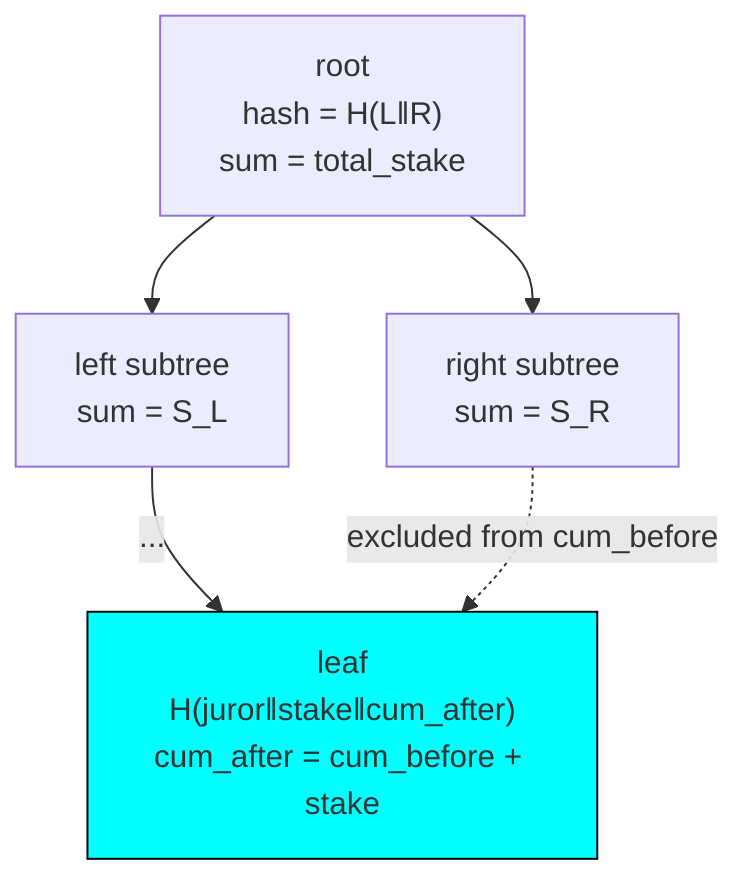

# Sortition & VRF

The draw trust chain. Randomness is committed once; jurors are selected deterministically from a Merkle-Sum Tree; every step is on-chain verifiable.

## Trust chain

```
1. request_vrf        ─►  VRF oracle (magicblock, ephemeral_vrf_sdk)
2. commit_vrf_callback◄─  oracle writes committed_vrf  (one-shot, identity-constrained)
3. post_snapshot      ─►  MST root + total_stake committed (bonded, 1-day challenge)
4. draw               ─►  on-chain verifies MST + sortition + inflation + distinctness
```

The committed VRF cannot be swapped between retries — `draw` reads `dispute.committed_vrf` immutably.

## VRF seed + slot selection

```
vrf_seed = hash(committed_vrf ‖ dispute ‖ round_idx ‖ draw_attempt)
r_i      = u64::from_le_bytes(hash(vrf_seed ‖ i_le)[0..8]) % total_stake
chosen_i = the unique leaf where  cum_before ≤ r_i < cum_after
```

The caller submits the leaf + proof; the chain recomputes `r_i` and enforces the range. Cherry-picking is impossible — a wrong leaf fails `SortitionMismatch`.

## Merkle-Sum Tree verification

Leaf = `H(juror ‖ stake_le ‖ cum_after_le)`. Internal = `H(left_hash ‖ right_hash)` with `sum = left_sum + right_sum`. Each proof element carries `(sibling_hash, sibling_sum)`.

`verify_mst_inclusion` checks three things:

1. Root hash matches (structural integrity).
2. Root sum matches `Snapshot.total_stake` (stake consistency).
3. `leaf.cum_after == cum_from_left + leaf.stake` (cumulative-range consistency — non-overlapping ranges).

`cum_from_left` = sum of all left-subtree siblings on the proof path = total stake of all leaves left of the target.



## Inflation guard (predicate 4)

For each drawn juror, `draw` reads the live `JurorStake` and requires `JurorStake.amount ≥ leaf.stake`. Reads current state, not the anchor snapshot, so it is immune to the deposit-after-snapshot race. Violation ⇒ `InflatedStake`, draw reverts.

## Distinctness

O(N²) pairwise check over the drawn set, `N ≤ 31`. No hash map on-chain. Collision ⇒ `DuplicateJuror`, retry with `draw_attempt + 1`.

## Cranker retry

A collision does **not** request new randomness. The same `committed_vrf` is reused with an incremented `draw_attempt`; the seed and every `r_i` change deterministically.

```typescript
import { requestVrf, resolvePanel, draw } from "@accord/sdk";

await requestVrf(accord.adapter, accord.PROGRAM_ID, { dispute });
// … commit_vrf_callback lands …
let attempt = 0;
let memberships;
do {
  memberships = await resolvePanel(snapshot, committedVrf, attempt); // off-chain
  try {
    await draw(accord.adapter, accord.PROGRAM_ID, {
      dispute,
      drawAttempt: attempt,
      memberships,
    });
    break;
  } catch (e) {
    if (!isDuplicate(e)) throw e;
    attempt++;
  }
} while (true);
```

Why: [ADR-0009](../adr/0009-stake-weighted-verifiable-sortition-mst-committed-vrf.md), [ADR-0008](../adr/0008-snapshot-trust-hardening-anchor-slot-and-verifiable-sortition.md). Fraud predicates that void the root: [fraud proofs](fraud-proofs.md).
